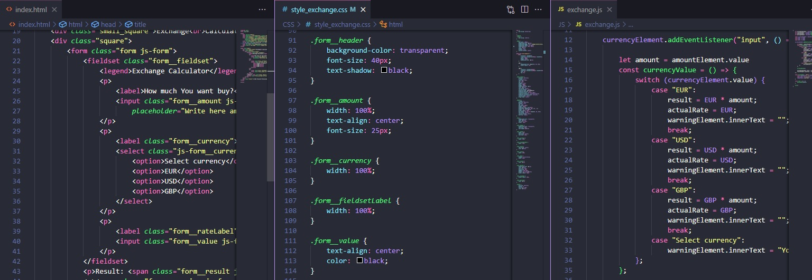

# Currency-calculator: 
PLN => EUR, 
PLN => USD, 
PLN => GBP

## This calculator helps You convert money from PLN (Polish złoty) to EUR (Euro), USD (U.S. Dollar), GBP (British Pound).

## On this page You can convert any amount of this 3 currency writed upper.
This funcion is added by Java Script file.

## Used technologies:
- HTML
- CSS
- Java Script ES6+
- BEM convension
- normalize.css
- Import date from API

## DEMO: https://krzysztof-broniszewski.github.io/Currency-calculator/

## 

